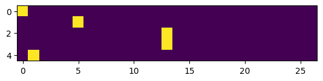
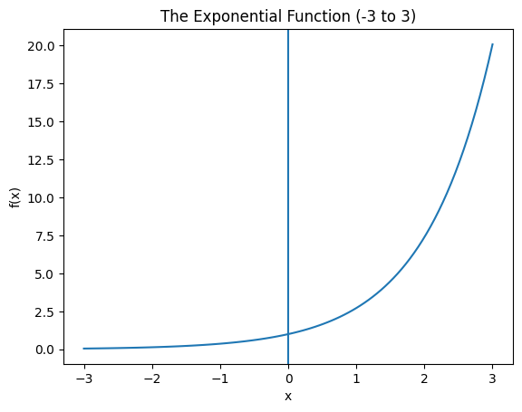

+++
title = 'A Neural Character Bigram Language Model'
date = 2026-08-15
slug = 'makemore-nn'
description = 'A neural character-level bigram language model, optimized with gradient descent rather than counted from the training data.'
tags = ['ai', 'language-models', 'neural-networks']
+++

In a [prior post]() in this series, we built a simple token-prediction model utilizing character bigrams. We "trained" this model by counting all of the bigrams in the training set and computing next-token probabilities on the basis of these bigram frequencies. In this post, we'll build precisely the same model under a completely different paradigm--by using a neural network to learn bigram probabilities that we can use to predict the next token in a sequence.

As before, the content in this post is based on Andrej Karpathy's [YouTube video](https://www.youtube.com/watch?v=PaCmpygFfXo) wherein he describes all of these concepts. All of the source code that I produced for this post is available in my [`makemore-and-friends`](https://github.com/turingcompl33t/makemore-and-friends) repository. 

## Architecture Overview

The desired architecture (in terms of inputs and outputs) for the model is the same as in the previous bigram model that used explicit counts:

- The input to the model is a single character
- The output of the model is a probability distribution over the predicted next character in the sequence

We already have a loss function (negative log likelihood), so we have a means of evaluating the model's prediction. When the model is implemented via a neural network, the existence of this loss function will allow us to automatically optimize the network's parameters with gradient-based optimization.

## Intuition Preview

Its easy to just take the "magic" of neural networks at face value here, without stopping to fully appreciate why an approach like this should work. The beauty of having first implemented the character-level bigram model via explicit counting is that we can use our prior experience to develop an _intuition_ for why the neural implementation works (and indeed, how it actually implements the exact same model as before).

The neural network we will use to perform next-token prediction will have just a single linear layer. The dimensions of this layer will be `(27, 27)`--precisely the same dimensions as the tensor that we used to represent bigram counts (and ultimately probabilities) in the previous implementation. We can thus think of the computation that the network's forward pass performs as implementing a probability lookup in the tensor that encodes our network. The only real difference, then, is how we arrive at the contents of this tensor--how we arrive at the bigram probabilities. Instead of counting, we'll learn the parameters via gradient-based optimization.

## Create the Training Set

We begin by constructing the training set. While we build the network, we'll use the entirety of the corpus for training. At the end of this post, we'll perform a train-test split to evaluate the final model.

First, we load the raw data from its file:

```python
data_dir = Path.cwd() / ".." / ".." / "data"

def load_names(path: Path) -> list[str]:
    with path.open("r") as f:
        return f.read().splitlines()


words = load_names(data_dir / "names.txt")
```

Each element of the list `words` is a name from the input data file:

```python
print(words)
# ['emma', 'olivia', 'ava', 'isabella']
```

With the dataset loaded, we can create the string-to-index and index-to-string lookup tables as in the [previous implementation](). The string-to-index (`stoi`) table maps characters to an integer index; the index-to-string (`itos`) table performs the reverse mapping.

With those mappings in place, we can extract all of the bigrams from the dataset. The final output of this step are two tensors, `xs` and `ys`. The `xs` tensor contains all of the first tokens in each bigram pair; the corresponding index in `ys` has the token that immediately follows this one.

```python
xs_raw, ys_raw = [], []
for w in words:
    chs = [TOKEN_DOT] + list(w) + [TOKEN_DOT]
    for l, r in zip(chs, chs[1:]):
        xs_raw.append(stoi[l])
        ys_raw.append(stoi[r])

xs = torch.tensor(xs_raw)
ys = torch.tensor(ys_raw)
```

For the complete dataset, `xs` and `ys` contain 228,146 entries; this implies 228,146 examples on which to train. For the purposes of constructing our model, we'll limit this to just the examples provided by the first word in the training set.

The first word in the training set is `emma`. We prefix and suffix the word with the special `.` character to mark the start and end of the word. Therefore, the 5 bigrams provided by the word `emma` are:

```
('.', 'e')
('e', 'm')
('m', 'm')
('m', 'a')
('a', '.')
```

We can now see how these bigrams are recorded in our `xs` and `ys` tensors. `xs` contains all of the first tokens (the first element of each tuple):

```python
print(xs)
#          .,  e, m,  m,   a
# tensor([ 0,  5, 13, 13,  1])
```

And `ys` contains all of the second tokens (the second element of each tuple):

```python
print(ys)
#          e, m,  m,   a,  .
# tensor([ 5, 13, 13,  1,  0])
```

## Encoding Network Inputs

As we stated at the beginning of this post, the input to the network is a single character. We have now encoded the characters as integers, but we still can't feed this in to a neural networks, for several compelling reasons:

- First, a scalar input here gives us a "rank-1" model. If the input is a scalar, the network's hidden layer must be of shape `(1, 27)`, making the logits (more on this later) for each input token produced by the forward pass a scalar multiple of the same vector. This results in a model with only 27 trainable parameters, creating limitations from _expressiveness_
- Integer inputs also impose false structure. The integers here are arbitrary labels; we just assigned them arbitrarily when creating our vocabulary lookup tables. But, once we starting doing arithmetic with them (as in the forward pass), we communicate things like: "the token `.` never contributes anything" and "the token `z` is 26x more important than the token `a`".

We can use one-hot encoding to get around these limitation. We encode each integer input as a vector with 27 entries--one for each of the tokens in our alphabet. Exactly one of the entries in the vector will be nonzero, the entry with an index that is equivalent to the value that is encoded.

We'll see what this implies about the structure (the dimensions) of the network itself below, but suffice it to say that this solves the expressiveness issue. It also removes the false structure issue because all of the 27 features in the input are treated as mutually orthogonal equidistant, with no apriori relationship.

Pytorch provides the [`one_hot`](https://docs.pytorch.org/docs/2.13/generated/torch.nn.functional.one_hot.html) from its [`functional`](https://docs.pytorch.org/docs/2.13/nn.functional.html) module that implements exactly this encoding. We can apply it to `xs`, specifying the desired number of classes in the output, to one-hot encode all 5 of the examples:

```python
import torch.nn.functional as F
xenc = F.one_hot(xs, num_classes=VOCAB_SIZE).float()
xenc.shape
# (5, 27)
```

The resulting tensor `xenc` is now of shape `(5, 27)`. Each row encodes an example (an input character) and each column in the row encodes one of the 27 tokens in the vocabulary. The nonzero entry in each row defines the input token that the row encodes.

We can dump `xenc` as an image to see its structure:



Row `0` corresponds with the first entry in `xs` that encodes the `.` token. This is reflected by the fact that the only nonzero entry in this row is at index `0` [1].

## Constructing the Network

Now that we can successfully encode our data such that it can be provided as input to a neural network, we can construct the network itself. The question before us is: how do we determine the dimensions of the tensor that represents our network?

We've already defined our network's input layer; it consists of a column vector with 27 features, each of which represents a token from the vocabulary.

In this example, our network consists of a single linear hidden layer. Every neuron in the hidden layer receives input from each of the 27 values in the input layer. Furthermore, we want the output of the network to be a probability distribution over the predicted next token, so the output shape must also be a vector with 27 features. 

These two facts completely determine the architecture of our network: we need 27 fully-connected neurons with an input layer dimension of `(1, 27)`, implying a network with dimensions `(27, 27)`. 

We can initialize a tensor `W` to represent our network. We use PyTorch's [`randn`](https://docs.pytorch.org/docs/2.13/generated/torch.randn.html) function to initialize a new tensor with random values drawn from a normal distribution:

```python
W = torch.randn((VOCAB_SIZE, VOCAB_SIZE))
W.shape
# torch.Size([27, 27])
```

We can now run a simple "forward pass" with this network against our inputs by performing matrix multiplication:

```python
output = xenc @ W
output.shape
# torch.Size([5, 27])
```

The output of the operation is a tensor with dimensions `(5, 27)`. This tracks with the rules of matrix multiplication:

```
(5, 27) @ (27, 27) -> (5, 27)
```

But how do we interpret this semantically?

- The first term represents the input layer with 5 input examples, each of which is represented by a column vector with 27 features
- The second term represents the network itself, a single fully-connected layer with 27 neurons

To understand output, important thing to notice here is that **this operation computes the activation for each of the inputs in the batch at the same time**. As was the case with the input, the first row of the output corresponds to all of the activations for the first input, and so on. 

So, suppose we examine the first row of the output:

```
output[0]
tensor([ 1.6579e-01,  5.8979e-01, -1.7885e+00,  1.4518e+00,  2.5412e+00,
         1.0963e+00, -2.6394e-03,  4.8180e-01,  4.5932e-01,  5.6697e-03,
         2.8073e+00, -6.2319e-01,  1.5854e+00, -7.3101e-03, -3.3038e-02,
         1.0176e-01, -9.9184e-01, -2.1956e-02, -6.6141e-01, -7.8543e-02,
         4.3610e-01,  7.7756e-01,  4.5298e-01, -1.8539e-01, -7.5326e-01,
         1.0434e-01,  8.7275e-02])
```

The value `1.6579e-1` in position `0` of this tensor means that `1.6579e-1` is the network's activation for the token that corresponds to index `0` (`.`) for the first input example (which, in this case, is also `.`). This logic applies to all values in this row, and for all rows in the output tensor.

Although they obfuscate the computations a bit, tensor operations like this make the computations required to train neural networks efficient.

There is another important equivalence to establish here: matrix multiplication between the one-hot encoded input and the matrix `W` simply performs a row lookup on the `W` matrix for the row that corresponds to the value that is encoded. More concisely, **for an input token with index `i`, it just selects row `i` of `W`**:

```
onehot(i) @ W == W[i]
```

We can see this in action. Lets lookup the row in W that corresponds to the input token 'e'. First, we do this via explicit indexing:

```python
index = stoi["e"]
W[index]
```

This gives:

```
tensor([ 0.1461,  0.0516,  0.3659, -0.3913,  2.1484, -0.8787,  0.7545, -0.1607,
        -1.5622,  1.5018,  1.7301, -1.2902, -2.2347, -0.0321, -0.2465, -0.3073,
        -0.4499,  2.2665, -0.1658, -0.6775, -1.3199,  0.7570,  0.1633, -1.4440,
         1.1816,  2.7562,  0.0536])
```

Now, we can perform the same lookup via matmul against the one-hot encoded input:

```python
# second example is ('e', 'm'), so xenc[1] encodes 'e'
print(xenc[1] @ W)
```

This gives:

```
tensor([ 0.1461,  0.0516,  0.3659, -0.3913,  2.1484, -0.8787,  0.7545, -0.1607,
        -1.5622,  1.5018,  1.7301, -1.2902, -2.2347, -0.0321, -0.2465, -0.3073,
        -0.4499,  2.2665, -0.1658, -0.6775, -1.3199,  0.7570,  0.1633, -1.4440,
         1.1816,  2.7562,  0.0536])
```

The tensors are equivalent. The importance of this completes an arc began in the previous section. When considering why we could not just feed scalar, integer inputs to a neural network, one of the reasons was expressiveness--with a scalar input, the activations for every input token are a scalar multiple of the same 27-feature vector. Now, however, **every input token gets its own, independent logit vector** that is activated by the encoding scheme. This means that during training, we'll only update the gradients that correspond to a particular input token when that token actually appears.

## Transforming Outputs

So far, we've just done `xenc @ W`. We haven't included a bias term, and we haven't introduced a nonlineary. 

This is all we are going to do for this particular implementation, but we have a problem: the output does not currently look anything like a probability distribution. We saw above that the values in `output[0]` are both positive and negative, and many are not on the range `[0, 1]`. We still have some work to do to transform the network's outputs in order to make this network viable for next-token prediction.

For each input example, we'd like to produce a probability distribution for the next character in the sequence. We want something similar to what we had last time: a `counts` tensor where, for each character, we had a probability distribution for each of the next characters.

We can move towards a solution by thinking of the 27 numbers in the output as log counts--the natural logarithm of the bigram count for the (input, output) token combination. We can thus exponentiate these "logits" to compute (pseudo) raw counts:

```python
counts = (xenc @ W).exp()
```

The first row of `counts` look like this:

```
tensor([ 1.1803,  1.8036,  0.1672,  4.2706, 12.6946,  2.9930,  0.9974,  1.6190,
         1.5830,  1.0057, 16.5652,  0.5362,  4.8810,  0.9927,  0.9675,  1.1071,
         0.3709,  0.9783,  0.5161,  0.9245,  1.5467,  2.1762,  1.5730,  0.8308,
         0.4708,  1.1100,  1.0912])
```

So exponentiation has gotten rid of the negative values. This makes sense, given the shape of the exponential function:



With this transformation, we can interpret the current output as "next character counts"--given a character, what is the raw count of the next character that occurs, throughout the training set? This is equivalent to a vector in our `N` matrix from the previous bigram model.

But we still don't have a probability distribution. To achieve this, we just need to normalize across each row:

```python
probs = counts / counts.sum(axis=1, keepdim=True)
```

Now, each row is a probability distribution. The first row now looks like:

```
tensor([0.0182, 0.0278, 0.0026, 0.0658, 0.1954, 0.0461, 0.0154, 0.0249, 0.0244,
        0.0155, 0.2550, 0.0083, 0.0751, 0.0153, 0.0149, 0.0170, 0.0057, 0.0151,
        0.0079, 0.0142, 0.0238, 0.0335, 0.0242, 0.0128, 0.0072, 0.0171, 0.0168])
```

So the values are now on `[0, 1]`. Furthermore, rows sum to `1`:

```python
probs[0].sum() # 1.0
```

Finally, we can interpret the output of the neural network as next character probabilities. We can trace a single input token all the way through the network's computation to see how this operates.

Consider the first input example in our training set, the bigram `(., e)`. The input character, `.`, is encoded as the integer value `0`. This is then one-hot encoded as a vector with 27 features that looks like:

```
tensor([1., 0., 0., 0., 0., 0., 0., 0., 0., 0., 0., 0., 0., 0., 0., 0., 0., 0.,
        0., 0., 0., 0., 0., 0., 0., 0., 0.])
```

We feed this example into the network (along with any other examples in the batch) by applying matrix multiplication with `W`. We exponentiate the raw activations and normalize across rows (examples) to produce a probability distribution that looks like:

```
tensor([0.0182, 0.0278, 0.0026, 0.0658, 0.1954, 0.0461, 0.0154, 0.0249, 0.0244,
        0.0155, 0.2550, 0.0083, 0.0751, 0.0153, 0.0149, 0.0170, 0.0057, 0.0151,
        0.0079, 0.0142, 0.0238, 0.0335, 0.0242, 0.0128, 0.0072, 0.0171, 0.0168])
```

Here, the position of each probability encodes the probability that is assigned to the character that corresponds to that index. The ground-truth next character for this particular training example is `e`, which corresponds to the integer `5` (`stoi['e']` -> `5`). We can access this particular probability value by indexing into the `probs` tensor further:

```python
probs[0][5]
# tensor(0.0461)
```

The network currently assigns a probability of 4.6% to `e` following `.`.

We can now map character's to next-token probabilities. What remains is finding a setting for the parameters in `W` that makes the probability distribution "good" in the sense that it makes loss low. Towards this end, its important to note that all of the operations our network performs are differentiable. We apply multiplication, exponentiation, and normalization (addition and division). This means that we'll be able to compute gradients through the entirety of the network's computation graph and use them to optimize the network's parameters.

## Aside: The Softmax Function

The two operations we applied to the hidden layer's raw activations, exponentiation and normalization, are frequently applied together to create a probability distribution from data that requires it. These operations together are called "softmax", and instead of computing it ourselves via exponentiation and normalization, we could have used PyTorch's integrated implementation:

```python
probs = F.softmax(logits, dim=1)
```

The resulting shape of `probs` is again `(5, 27)`, and the values are identical to those we computed earlier.

## Vectorized Loss

Before we can start optimizing, we need a loss function. We'll use this to assess the current performance of the network, which is a necessary component of gradient-based optimization.

Intuitively, for each example, we want to know the probability that is assigned to the known, correct next token in the sequence. When this probability is high, the loss for this example should be low. Likewise, when this probability is low, the corresponding loss should be high.

We use the negative log-likelihood as our loss function. I walked through the justification for this function, as well as a scalar computation for it, in the [previous post](). The difference here will be that we want to compute the loss in a vectorized manner to make it computationally efficient.

We start with our `probs` tensor with dimensions `(N, 27)` where `N` is the number of examples in the batch. Thus far we've been working with `N = 5`. The tensor provides a probability distribution over next tokens for each example. For calculating the loss, we want only the probability assigned to the correct next token for each example. We can use some clever tensor indexing to achieve this:

```python
probs[torch.arange(xs.nelement()), ys]
# tensor([0.0461, 0.0143, 0.0177, 0.0270, 0.0026])
```

The first term in the indexing expression merely grabs each row, while the `ys` term grabs the particular value from that row that corresponds to the probability for the correct next token.

We can then apply vectorized logarithm and mean, and negate the value to get the final loss expression:

```python
loss = -probs[torch.arange(5), ys].log().mean()
```

## Current Performance, and A Terrible Optimization Process

Ahead of applying gradient descent to optimize the network, we'll look at how it currently performs. For each of the bigrams supplied by the first word in the training set, we can examine both the probability the network currently assigns to this bigram, and the associated loss:

```
bigram is (.,e)
  . index = 0
  e index = 5
  probability assigned = 2.52%
  loss = -3.68
bigram is (e,m)
  e index = 5
  m index = 13
  probability assigned = 1.96%
  loss = -3.93
bigram is (m,m)
  m index = 13
  m index = 13
  probability assigned = 11.95%
  loss = -2.12
bigram is (m,a)
  m index = 13
  a index = 1
  probability assigned = 3.02%
  loss = -3.50
bigram is (a,.)
  a index = 1
  . index = 0
  probability assigned = 1.30%
  loss = -4.34
```

We can also compute the current aggregate loss across all examples, which, in this case, is `3.516`.

I'm using a PyTorch [`Generator`](https://docs.pytorch.org/docs/2.13/generated/torch.Generator.html) to make the initialization of the network `W` consistent across invocations. We can change the seed for the generator to see how re-sampling `W` changes this aggregate loss. For instance, when I update the seed from `1337` to `1337 + 1`, the aggregate loss increases to `4.993`.

This simple example is instructive because we can think of random guess and check as a terrible optimization process. Updating the parameters of `W` influences the next token probability assignments the network produces, in turn updating the loss each example incurs. Now, we'll guide the updates to `W` by computing gradients based on this loss.

## Backward Pass + Update

To update the parameters of `W` based on our loss calculation, we need to compute the derivative of the loss with respect to each of the parameters of `W`.

PyTorch provides builtin automatic differentiation. So long as we indicate to PyTorch that we want to compute gradients, it automatically records the complete computation graph for our tensor `W`, giving us everything we need to automatically calculate the required derivatives.

We initialize the network, compute the forward pass, and the loss:

```python
W = torch.randn((VOCAB_SIZE, VOCAB_SIZE), generator=gen, requires_grad=True)

# forward
counts = (xenc @ W).exp()
probs = counts / counts.sum(axis=1, keepdim=True)

loss = -probs[torch.arange(5), ys].log().mean()
```

Then, we invoke `loss.backward()` to perform the backward pass and automatically populate the gradients for each element of `W`. Prior to doing so, we explicitly clear any existing gradient values:

```python
W.grad = None  # zero the gradient
loss.backward()
```

Invocation of `loss.backward()` populates the `grad` property of `W` with gradients corresponding to each value in the tensor. We can examine the shape of this tensor:

```
W.grad.shape
# (27, 27)
```

And the first of its rows:

```
# W.grad[0]
tensor([ 0.0059,  0.0046,  0.0034,  0.0020,  0.0092, -0.1950,  0.0127,  0.0052,
         0.0070,  0.0158,  0.0013,  0.0029,  0.0062,  0.0039,  0.0020,  0.0230,
         0.0189,  0.0043,  0.0065,  0.0129,  0.0006,  0.0080,  0.0217,  0.0089,
         0.0056,  0.0010,  0.0015])
```

The value `0.0059` at position `(0, 0)` in the `grad` tensor implies that the parameter at this position contributes positively to loss--increasing the parameter's value by a small amount increases loss by `0.0059`. Likewise, the sixth entry in this row (`-0.1950`) contributes negatively to loss, so increasing the parameter's value will cause loss to decrease.

With these gradients, we can apply a manual update to `W`:

```python
W.data += -0.1 * W.grad
```

We can run this procedure a few times, manually, to observe aggregate loss decrease as the parameters of the network are slowly nudged to decrease the loss:

```
loss = 3.516
loss = 3.497
loss = 3.478
loss = 3.459
...
```

## Putting it Together

We can now integrate all of these pieces to apply gradient-based optimization to our network. In this pass, we extract and train on all bigrams from the training set.

The complete training loop looks like:

```python
for k in range(1024):
    # encoding
    xenc = F.one_hot(xs, num_classes=VOCAB_SIZE).float()

    # forward pass
    logits = xenc @ W
    counts = logits.exp()
    probs = counts / counts.sum(axis=1, keepdim=True)

    # loss
    loss = -probs[torch.arange(xs.nelement()), ys].log().mean()

    # backward pass
    W.grad = None
    loss.backward()

    # update
    lr = 50.0 * (0.99**k)
    W.data += -lr * W.grad
```

Here, we apply some exponential learning rate decay across 1,024 iterations. When I run the training procedure, I achieve a final training loss of `2.47`. The model appears to converge at or before 400 iterations.

## Sampling from the Model

The code to sample from the model is similar to the implementation used for the [previous model]().

```python
def sample_one(model: torch.Tensor, g: torch.Generator) -> str:
    word = ""

    ix = 0  # 0 is the index of the start token '.'
    while True:
        # forward pass
        input = (
            F.one_hot(torch.tensor(ix), num_classes=VOCAB_SIZE)
            .reshape((1, VOCAB_SIZE))
            .float()
        )
        counts = (input @ model).exp()
        probs = counts / counts.sum(axis=1, keepdim=True)

        # sample an index from the distribution
        ix = torch.multinomial(probs, num_samples=1, generator=g).item()

        # check if this is the stop token
        if ix == 0:
            return word

        # add the character to the growing word
        word += itos[ix]
```

We can run this a few times to sample some words from the model. For example:

```
gun
kaneliy
dy
exulell
eleleahmariss
```

## Packaging Everything Up

I packaged up all of the logic from this implementation into a class `BigramNN`. Along with a few other helpers for managing the vocabulary and and the training loop, utilizing it looks like:

```python
from makemore.vocab import Vocab
from makemore.bigram_nn import BigramNN
from makemore.train import SGD, train

vocab = Vocab.from_words(words)

model = BigramNN(vocab)
opt = SGD(model.parameters(), lr=50.0)
history = train(model, words, opt, steps=1024,
                  lr_schedule=lambda i: 50.0 * (0.99**i))
```

After taking it for a spin across 1,024 steps, we get:

```python
print(f"loss = {history[-1]}")
# loss = 2.4739224910736084
```

And we can sample from it efficiently:

```python
for name in model.sample(5):
    print(name)
# gun
# kaneliy
# dy
# exulell
# eleleahmariss
```

We achieve the same training loss and samples as the "raw" example from the notebook.

## Conclusion: Counting vs Neural Networks

The minimum training loss achieved with the neural bigram model is `2.47`. For the counting bigram model it was `2.45`. The two converge to nearly identical performances.

More importantly, though, while the counting approach is simpler, it is much less scalable. The neural approach is very flexible and therefore scalable to more powerful approaches. Much of the machinery (e.g. all of the optimization machinery) will stay the same with more and more sophisticated models that we'll explore in future posts.

## Endnotes

[1] Staring at this image, you might get the sense that one-hot is a wasteful way to represent the input--a `(5, 27)` tensor that is 26/27 zeros. That intuition is correct, and it becomes sharper once we see the forward pass below.

Because every row of `xenc` is one-hot, the matrix multiplication `xenc @ W` doesn't really _compute_ anything. For an input token with index `i`, it just selects row `i` of `W`:

```
onehot(i) @ W == W[i]
```

Every other row of `W` gets multiplied by zero and thrown away. We do 27 multiply-adds per output feature--729 per example--to accomplish what a single array index would do.

So real implementations skip the one-hot tensor entirely and index into `W` directly. This is precisely what PyTorch's [`nn.Embedding`](https://docs.pytorch.org/docs/2.13/generated/torch.nn.Embedding.html) and [`F.embedding`](https://docs.pytorch.org/docs/2.13/generated/torch.nn.functional.embedding.html) do, and the gradients work out the same way: only the rows that actually appear in the batch receive gradient.

We stick with the explicit one-hot here because it keeps the shapes of the forward pass easy to follow, and because it makes the "this really is just a neural network doing a matrix multiply" framing concrete.
