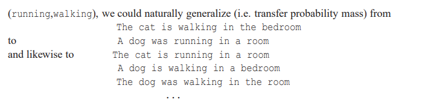
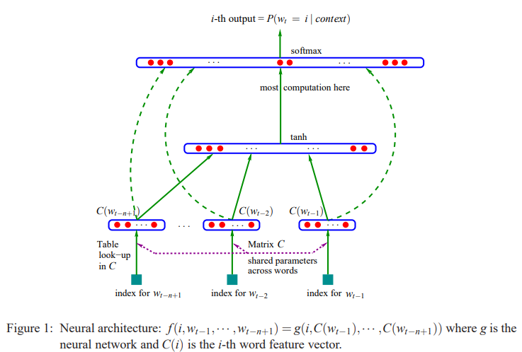
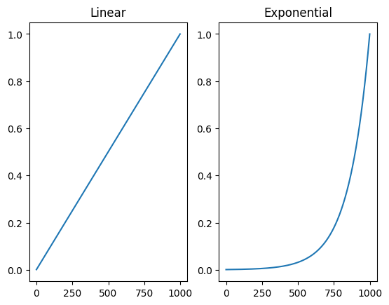
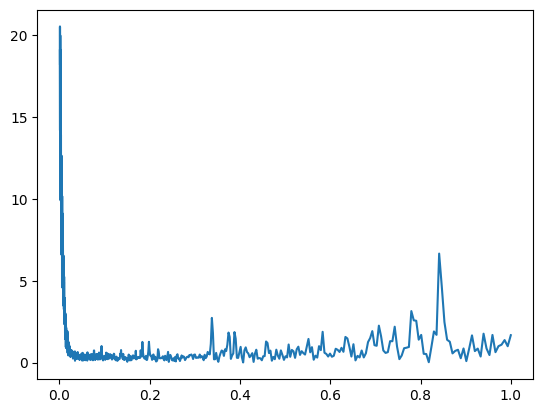
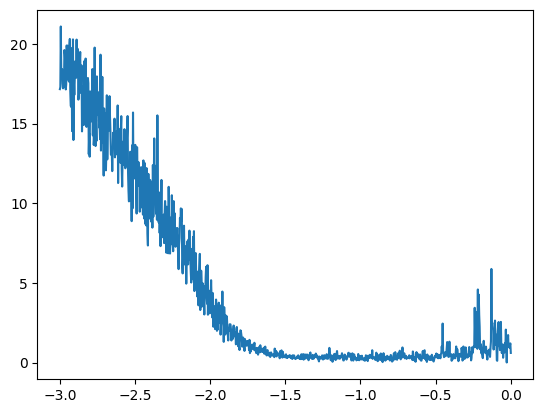

+++
title = 'Next Token Prediction with MLP'
date = 2026-08-30
slug = 'makemore-mlp'
description = 'Extending makemore with an MLP, and running some experiments to minimize validation loss'
tags = ['ai', 'language-models', 'neural-networks']
+++

In a [prior post]() in this series, we built a simple character-level language model with a single-layer neural network and optimized it via gradient descent. In this post, we'll extend the existing neural network architecture with multiple layers, and run some more in-depth experiments to tune our model's hyperparameters and minimize validation loss.

As before, the content in this post is based on Andrej Karpathy's [YouTube video](https://www.youtube.com/watch?v=TCH_1BHY58I&list=PLAqhIrjkxbuWI23v9cThsA9GvCAUhRvKZ&index=3) wherein he describes all of these concepts. The model itself is based on a 2003 implementation by [Bengio et al.](https://www.jmlr.org/papers/volume3/bengio03a/bengio03a.pdf). All of the source code that I produced for this post is available in my [`makemore-and-friends`](https://github.com/turingcompl33t/makemore-and-friends) repository. 

### TL;DR

- We adopt the modeling approach from [_A Neural Probabilistic Language Model_](https://www.jmlr.org/papers/volume3/bengio03a/bengio03a.pdf) (Bengio et al., 2003) to update our previous character bigram model
- The new architecture includes an initial _embedding layer_ followed by a hidden layer with a configurable size
- We shift from computing gradients with every input example in each iteration of the optimization loop to optimizing with minibatches
- We also run through a simple empirical procedure to determine a good initial learning rate for our new model
- Finally, we run some hyperparameter tuning experiments to achieve a minimum validation loss of `2.16`, just `0.01` lower than Andrej achieves in his video version of this model build

### Weakness of the Prior Approach

Our previous approach using character bigrams is straightforward, but it suffers from the obvious shortcoming that the predictions are not very good. The best loss we achieved is still high, and the outputs don't really resemble names yet:

```
gun
kaneliy
dy
exulell
eleleahmariss
```

Our performance weakness is a result of the fact that we only take 1 previous character into account--the length of our _context_ is fixed at `1`. We could presumably produce high-quality predictions if we increase the context length to take more characters into account, but doing this with our current model architecture isn't particularly scalable.

If we take just one prior character as context as we did in the bigram case, we have a counts matrix that contains 27 rows (one for each character). If we take two prior characters, we have 27x27 rows which yields 729 rows. With a context of three characters, the matrix contains 27**3 (19,683) rows.

The number of rows in this matrix grows exponentially in the number of characters in the context. This approach is too naive to scale well, so we'll adopt a smarter one that allows us to efficiently scale the length of our context.

### The Updated Approach

We'll follow the architecture described by Bengio et al. in [_A Neural Probabilistic Language Model_](https://www.jmlr.org/papers/volume3/bengio03a/bengio03a.pdf). The paper describes a word-level model where ours will operate on individual characters, but the modeling approach and architecture will be equivalent.

The authors describe the key insight of their paper as: "fighting the curse of dimensionality with distributed representations." They elaborate on this by stating that, in a nutshell, the approach can be summarized as:

> 1. associate with each word (character) in the vocabulary a distributed word (character) feature vector 
> 2. express the joint probability function of word (character) sequences in terms of the feature vectors of these words (characters) in the sequence, and
> 3. learn simultaneously the word (character) feature vectors and the parameters of that probability function

So, the approach does not operate on the words directly, but rather on _embeddings_ of the words into a fixed-dimensional feature space. The authors utilize a vocabulary of 17,000 words that they embed into a 30-dimensional feature space, representing a massive reduction in dimensionality of the input space. They then tune these embeddings along with the probability function (computed via the remaining layers of the neural network) via gradient descent.

We can perform the same embedding process for our characters; taking a 27-dimensional input space to one that is much smaller. We'll use a multi-layer neural network to predict the next character in a sequence, and optimize it by minimizing negative log likelihood--the same loss function used in [prior posts]().

**Intuition**

Aside from reducing the dimensionality of the input and thereby making training computationally tractable, why does embedding the input characters into a lower-dimensional feature space make sense? The embedding space allows us to transfer knowledge from examples that we encounter during training to those that may be out-of-distribution at test time. Bengio et al. provide the following example to help arrive at the intution for this:



They argue that words with similar semantic meanings will naturally occur close to one another in the embedding space. This means that encountering one sequence during training will not only increase the probability of generating that sequence at test time, but also increase the probability of generating semantically-similar sequences.

**Architecture Overview**

The high-level architecture for the model we'll build appears below:



We take three previous characters as context and use these to predict the next character. The context length is also a variable we can control, but we'll use a context length of three while building the model.

The first layer of the model is the lookup table `C` that gets the embedding for each character in the vocabulary. Therefore, for our use case, the lookup table will have shape `(27, embedding_dimension)`, where `embedding_dimension` is the dimension of the space into which we'll embed characters.

This entire input layer is contains `embedding_dimension` neurons for 3 characters, giving us 3*`embedding_dimension` neurons total in the input layer.

After the input layer comes the hidden layer. The size of the hidden layer is a hyperparameter of the network. This layer is fully connected to the input layer, and employs a hyperbolic tangent (`tanh`) nonlinearity.

Finally, the output layer has one neuron for each character in our vocabulary, or 27 neurons. We'll employ a softmax layer to get a probability distribution over the next character in the sequence given the activations from this layer.

### Building our Dataset

With the overview of what we'll build established, we can begin. We begin by loading the dataset, which is a text file containing 32,033 names, one per line:

```python
words = load_names(data_dir / "names.txt")
print(len(words))  # 32033
print(words[:4])   # ['emma', 'olivia', 'ava', 'isabella']
```

In the `makemore` library, I wrote a helper function that builds the dataset vocabulary from the input words. Invoking it looks like:

```python
vocab = Vocab.from_words(words)
```

Under the hood, it just builds the lookup tables from index to string and string to index. It also defines `.` as the special boundary token, for a total vocabulary size of 27 characters:

```python
class Vocab:
    # ...

    # index-to-string
    self.itos: list[str] = [TOKEN_BOUNDARY, *sorted(chars)]
    # string-to-index
    self.stoi: dict[str, int] = {c: i for i, c in enumerate(self.itos)}
```

Now, to actually make our dataset, we need to split up the input examples into _context_ and _prediction_ - context are the `n` prior characters that we want to consider when predicting the next character, and prediction is the character that is being predicted. The parameter `block_size` controls the size of the context. As mentioned above, we'll just assume a context length of `3` throughout.

The `make_dataset` function from `makemore` performs this split for us, producing context as rows of the tensor `X` and the accompanying prediction as the matching rows of the tensor `Y`:

```python
X, Y = make_dataset(words, vocab, block_size=3)
```

Under the hood, this function contains largely the same logic as we've seen previously, although now the context length is a variable controlled by `block_size`:

```python
xs: list[list[int]] = []
ys: list[int] = []

for word in words:
    context = [vocab.stoi[TOKEN_BOUNDARY]] * block_size
    for ch in list(word) + [TOKEN_BOUNDARY]:
        ix = vocab.stoi[ch]
        xs.append(context)
        ys.append(ix)
        # roll the context forward by one token
        context = context[1:] + [ix]

return torch.tensor(xs), torch.tensor(ys)
```

Now we can run this code to produce datasets for training and (later) evaluation. Initially we just run this with the first 5 words in the corpus to make things easier. This results in 32 examples for training while we build the network.

Before moving one, we can run the above functions with different values for `block_size` to get a sense for how the processed dataset looks. Below, I map the character indices back to the character they represent to make the visualization easier.

When `block_size=2`, our first 5 examples look like:

```
.. --> e
.e --> m
em --> m
mm --> a
ma --> .
```

When `block_size=3`:

```
... --> e
..e --> m
.em --> m
emm --> a
mma --> .
```

And when `block_size=4`:

```
.... --> e
...e --> m
..em --> m
.emm --> a
emma --> .
```

Notice that the number of examples produced by each word in the input does not change with the block size--the word `emma` always results in five examples for training, regardless of what the block size is.

With a `block_size` of `3`, our final shapes (and datatypes) for `X` and `Y` look like:

```python
print(X.shape, X.dtype, Y.shape, Y.dtype)
# (torch.Size([32, 3]), torch.int64, torch.Size([32]), torch.int64)
```

### Building the Network

We'll start building the network by constructing the lookup table `C`. We initialize it randomly:

```python
C = torch.randn((len(vocab), embedding_dimension))
```

The first operation in our network is to get the embedding for each of the characters in the input context. We can do this via an indexing operation, looking up the index to which the character corresponds via the mapping maintained by our vocabulary:

```python
C[vocab.stoi["e"]]
# tensor([-0.4712, -1.3342])
```

Its interesting to note that there is equivalence between indexing with the index that corresponds to the character of interest, and matrix multiplication with the one-hot encoding of our vocabulary. The following operation is equivalent to the explicit indexing above:

```python
F.one_hot(torch.tensor(vocab.stoi["e"]), num_classes=len(vocab)).float() @ C
# tensor([-0.4712, -1.3342])
```

This the way we implementing a similar lookup in our previous bigram model, but indexing directly is considerably more efficient than the matmul approach, so we'll stick with indexing our in our implementation.

**Embedding All Inputs Simultaneously**

The first layer of our network is a means of selecting the embedding for each character in our context. We saw above how we can do this for a single character with the embedding table `C`, but how can we do this (a) multiple characters in the context and (b) multiple distinct examples, each with their own multi-character context?

The key observation here is that we can index into a PyTorch `tensor` with other tensors, including multidimensional ones.

For each row in `X`, we want to get the embedding from `C` for each of `block_size` (3) input characters in the context.

If we look at a single row of `X`, we have three indices, corresponding to the three characters in the block:

```python
X[0]
# tensor([0, 0, 0])
```

If we index into `C` with this tensor, we get the corresponding embedding for each of the three characters:

```python
C[torch.tensor([0,0,0])]
# tensor([[ 0.9462, -0.0975],
#        [ 0.9462, -0.0975],
#        [ 0.9462, -0.0975]])
```

But we can just index directly into the tensor with `X`:

```python
C[X].shape
# (32, 3, 2)
```

This works because, for `C` of shape `(V, D)` and an integer tensor `idx` of any shape `S`, we have that:

```
C[idx].shape == S + C.shape[1:]
```

Here we have `C` with shape `(27, 2)` and integer tensor `idx` with shape `(32, 3)`. The property holds:

```
# S.shape   # C.shape[1:]    # C[idx].shape
(32, 3)   + (,2)          == (32, 3, 2)
```

The indexed dimension (`V`) is replaced by the entire shape of the index tensor, and the remaining dimensions of  `C` are appended unchanged.

Therefore, all we have to do to implement our input layer is:

```python
emb = C[X]
emb.shape
# torch.Size([32, 3, 2])
```

**Constructing the Hidden Layer**

Now we know how to get the embeddings for each of the input characters in the context, so it is time to move on to the hidden layer.

The number of inputs to this layer varies with two things:

- the `block_size`
- the embedding dimension

Together, these two hyperparameters determine the number of neurons in the input layer. Here, we have a `block_size` of 3 and an embedding dimension of 2, giving us 6 inputs to this layer. Now we can initialize its parameters:

```python
# parameters for hidden layer
W1 = torch.randn((6, 100))
b1 = torch.randn(100)
```

In order to implement this layer efficiently, we need to transform the `(32, 3, 2)` output from the input layer to a tensor with shape `(32, 6)` in order to perform naive matrix multiplication here to implement the forward pass.

The simplest (and most efficient) way to do this is to use [`torch.view`](https://docs.pytorch.org/docs/2.13/generated/torch.Tensor.view.html). This is efficient because it doesn't allocate any new storage; it merely changes some metadata about the tensor.

```python
emb.view((-1, 6))
```

Here, we can use `-1` as the first parameter to avoid hardcoding this implementation for the number of rows in `emb`. The way this embeddings tensor `emb` gets flattened to make it `(32, 6)` meets our intent.

Now we can multiply our embeddings by our weights `W1` and add our biases `b1` to continue with the forwad pass:

```python
emb.view((-1, 6)) @ W1 + b1
```

We apply the [`tanh`](https://docs.pytorch.org/docs/2.13/generated/torch.tanh.html) activation function to complete the forward pass for the hidden layer:

```python
h = torch.tanh(emb.view((-1, 6)) @ W1 + b1)
h.shape # (32, 100)
```

**The Final Layer and Loss**

The hidden layer is straightforward. We know we want `len(vocab)` (27) activations as output from the layer, and the number of inputs is determined by the number of neurons in the hidden layer (currently 100). We can randomly initialize our weights and biases:

```python
W2 = torch.randn((100, len(vocab)))
b2 = torch.randn(len(vocab))
```

And computing our logits is as simple as:

```python
logits = h @ W2 + b2
logits.shape # (32, 27)
```

To compute negative log likelihood, we need to exponentiate the logits and normalize across rows to create a probability distribution. previously, we used a combination of `.exp()` and manual summation / division to implement this.

```python
counts = logits.exp()
probs = counts / counts.sum(axis=1, keepdim=True)
loss = -probs[torch.arange(32), Y].log().mean()
loss # 14.7941
```

However, better way to implement this same calculation is with [`torch.nn.functional.cross_entropy`](https://docs.pytorch.org/docs/2.13/generated/torch.nn.functional.cross_entropy.html):

```python
import torch.nn.functional as F
loss = F.cross_entropy(logits, Y)
loss # 14.7941
```

I discuss some of the reasons to prefer `F.cross_entropy()` to the hand-rolled implementation in [[1]](#footnotes). We'll us `F.cross_entropy()` going forward instead of the manual probability distribution computation.

**The Complete Forward Pass**

The complete forward pass looks like this:

```python
# embed all blocks for each input example
emb = C[X]
# hidden layer activations
h = torch.tanh(emb.view((-1, 6)) @ W1 + b1)
# logits (activations from output layer)
logits = h @ W2 + b2
# NLL loss
loss = F.cross_entropy(logits, Y)
```

### Wrapping the Forward Pass and a Simple Training Loop

Now that we've defined the forward pass, we can wrap the logic in the `.forward()` method on the `MLP` class:

```python
# class MLP
def forward(self, ctx: torch.Tensor) -> torch.Tensor:
    emb = self.C[ctx]
    # hidden layer activations
    h = torch.tanh(
        emb.view((-1, self.block_size * self.embedding_dimension)) @ self.W1
        + self.b1
    )
    # logits (activations from output layer)
    logits = h @ self.W2 + self.b2
    return logits
```

Now, computing the forward pass and loss looks like:

```python
from makemore.mlp import MLP

model = MLP(vocab)
logits = model.forward(X)
loss = F.cross_entropy(logits, Y)
```

And we can wrap this model in a simple training loop to watch the optimization process:

```python
for _ in range(10):
    # forward pass
    logits = model.forward(X)
    loss = F.cross_entropy(logits, Y)
    print(loss.item())

    # backward pass
    for p in model.parameters():
        p.grad = None
    loss.backward()

    # update
    for p in model.parameters():
        p.data += -0.1 * p.grad
```

### Introducing Mini-Batches

In this training loop, we compute the forward pass over all inputs in the dataset, and subsequently utilize the loss computed from each of these examples to run the backward pass and update weights.

In practice, its more common to train on "minibatches" where we randomly select a small number of examples from the full training set for each iteration and only use this subset to compute the forward pass and subsequent gradient-based updates. This implies that we compute an approximate gradient, and increase the number of iterations, rather than computing a gradient from the entire training set and running optimization for a relatively smaller number of iterations. This often results in [stronger optimization behavior](https://datascience.stackexchange.com/questions/16807/why-mini-batch-size-is-better-than-one-single-batch-with-all-training-data).

In our training loop, we can introduce minibatches with just a single line:

```python
batch_size = 32

for _ in range(100):
    # construct the minibatch
    ix = torch.randint(0, X.shape[0], (batch_size,))

    # forward pass
    logits = model.forward(X[ix])

    # ... training loop as before
```

We use [`torch.randint`](https://docs.pytorch.org/docs/2.13/generated/torch.randint.html) to generate the `ix` index tensor, and we subsequently utilize this to index into `X` and select a subset of its rows while computing the forward pass.

### Finding a Good Initial Learning Rate

In our training loop, our update step currently looks like:

```python
# update
for p in model.parameters():
    p.data += -0.1 * p.grad
```

Our learning rate, `0.1`, was chosen arbitrarily. We can find and validate a good initial setting for this learning rate through a simple empirical procedure.

First, we just need to find a range of learning rates that makes sense. We accomplish this by training our model for a small number of steps (say 100) and observing how the loss changes with different learning rates. Reset the model's parameters at the end of each test.

In our case, with a learning rate of `0.0001`, we don't see any real change in the loss. At the other end of the spectrum, with a learning rate of `10`, our loss is totally unstable, and the network doesn't optimize. Therefore, we can conclude that a reasonable range for the learning rate is between `1` and `0.001`.

Now, once we have this range, we can search it for a good learning rate value. We do this by first generating many candidate learning rates in the range we just found.

One way we can distribute these learning rates is linearly:

```python
lrs = torch.linspace(0.001, 1, 1000)
```

We can also distribute them exponentially:

```python
lre = torch.linspace(-3, 0, 1000)
lrs = 10**lre
```

In the exponential case, we'll have denser values with lower learning rates, and sparser values for higher ones. Depicted graphically, this looks like:



We'll use the exponential distribution of learning rates for our analysis. Now, we can run the training loop for 1000 iterations, using the corresponding learning rate from `lrs` in each iteration, and observe how the loss behaves as the learning rate changes:

```python
batch_size = 32

lri = []
lossi = []
for i in range(len(lrs)):
    # construct the minibatch
    ix = torch.randint(0, X.shape[0], (batch_size,))

    # forward pass
    logits = model.forward(X[ix])
    loss = F.cross_entropy(logits, Y[ix])

    # backward pass
    for p in model.parameters():
        p.grad = None
    loss.backward()

    # update
    lr = lrs[i]
    for p in model.parameters():
        p.data += -lr * p.grad  # type: ignore

    lri.append(lre[i])
    lossi.append(loss.item())
```

When we plot the loss against raw learning rates, we get:



However, its slightly easier to see the shape of the results when we plot the loss against the exponent of the learning rate, rather than the raw learning rate itself:



We can see that the optimal learning rate lies somewhere between an exponent of `-1.5` and -`1`, translating to a learning rate of around `0.01`.

### Beating Andrej's Best Validation Loss (Barely)

Now that we have a decent understanding for how we should set our learning rate, we can run a more rigorous experiment to tune our model's hyperparameters and see what level of performance we can achieve.

The high-level structure for the experiment is something like:

```
for each hyperparamter setting:
    1. create a model with the given hyperparameters
    2. run training
    3. compute the validation loss
    4. track if this is the best setting we've seen thus far, based on the validation loss
```

We'll see the actual code I wrote for this in just a second, but first we need to define all of the inputs to the experiment.

**Building the Hyperparameter Grid**

The first thing we'll do is define the range of hyperparameters over which we'll search. For my experiment, I just looked at two hyperparameters: `embedding_dimension` and `hidden_layer_size`, with the candidate values below:

```python
hyperparameters = {
    "embedding_dimension": [2, 5, 10],
    "hidden_layer_size": [100, 250, 500],
}
```

I wrote a little [helper function](https://github.com/turingcompl33t/makemore-and-friends/blob/master/makemore/src/notebooks/mlp.ipynb) to generate a hyperparameter grid, given an input like the above. It makes use of the standard library's [itertools](https://docs.python.org/3/library/itertools.html) and [functools](https://docs.python.org/3/library/functools.html) to accomplish this:

```python
import itertools
import functools

def hyperparameter_grid(hps: dict[str, list[int]]) -> list[dict[str, int]]:
    inputs = [[{key: v} for v in values] for key, values in hps.items()]
    prod = itertools.product(*inputs)
    return [functools.reduce(lambda a, b: a | b, setting) for setting in prod]
```

I love it when a seemingly-complex operation like the final line here can be accomplished via a nice one-liner with the help of something like `functools.reduce`.

Invoking this function on the search space defined previously gives a complete hyperparameter grid that looks like:

```
[{'embedding_dimension': 2, 'hidden_layer_size': 100},
 {'embedding_dimension': 2, 'hidden_layer_size': 250},
 {'embedding_dimension': 2, 'hidden_layer_size': 500},
 {'embedding_dimension': 5, 'hidden_layer_size': 100},
 {'embedding_dimension': 5, 'hidden_layer_size': 250},
 {'embedding_dimension': 5, 'hidden_layer_size': 500},
 {'embedding_dimension': 10, 'hidden_layer_size': 100},
 {'embedding_dimension': 10, 'hidden_layer_size': 250},
 {'embedding_dimension': 10, 'hidden_layer_size': 500},
 {'embedding_dimension': 15, 'hidden_layer_size': 100},
 {'embedding_dimension': 15, 'hidden_layer_size': 250},
 {'embedding_dimension': 15, 'hidden_layer_size': 500}]
```

There are more values that we might consider searching over here, like the `block_size` and the `batch_size`. I'll comment on what I found for these after summarizing my results.

**Splitting the Dataset - Train, Validation, and Test**

During the hyperparameter search, for each candidate setting, we need a means of evaluating how good it is relative to the others. Instead of looking directly at the training loss though, we'll instead consider _validation loss_, or the loss on some other held-out set of data that was not encountered during training. 

In general, its common to have three distinct splits of our entire dataset:

- `train` - the data on which we run gradient-based optimization with a given set of hyperparameters
- `dev` (or `val`) - the data on which we run our hyperparameter search, using it as a means of assessing the quality of a given hyperparameter setting while also giving us a better indication of how well our model will generalize to unseen data
- `test` - the data we use for a final test of our model's quality; the `test` data should be seen very rarely, if ever, during the entire training pipeline

I wrote a little helper function in `makemore` to split a dataset into these three groups:

```python
from makemore.data import split
train, dev, test = split(words, fractions=(0.8, 0.1))
```

With this invocation, we get a `train` set that is 80% of the total examples, a `dev` set that is 10%, and a `test` set that is also 10%.

**Defining Learning Rate Schedule**

We saw before that the ideal learning rate for this model is somewhere between `0.01` and `0.1`. During my experiment, I employ [learning rate decay](https://en.wikipedia.org/wiki/Learning_rate) to recduce the learning rate by a factor of 10, from `0.1` to `0.01` at the halfway point of the training process:

```python
lr_schedule = lambda step: 0.01 if step / train_steps > 0.5 else 0.1
```

This helps our model find a local-minimum point for the loss by reducing the probability that we continuously "jump over" it with a constant learning rate that is too high.

**Results**

The full experiment loop that I wrote to explore hyperparameters looks like this:

```python
import makemore.train as training
from makemore.mlp import MLP

train_steps = 150_000
lr_schedule = lambda step: 0.01 if step / train_steps > 0.5 else 0.1

# best setting of hyperparameters
best_setting = {}
# best validation loss
best_valloss = 100.0

for i, setting in enumerate(grid):
    # 1. create the model
    model = MLP(vocab, **setting)
    
    # 2. run training
    opt = training.SGD(model.parameters(), lr=lr_schedule(0))
    losses = training.train(
        model,
        train,
        opt,
        steps=train_steps,
        batch_size=32,
        lr_schedule=lr_schedule,
    )

    # 3. compute validation loss
    val_loss = model.loss(X_dev, Y_dev)

    # 4. track the best
    if val_loss < best_valloss:
        best_valloss = val_loss
        best_setting = setting
```

After running the twelve iterations implied by my hyperparameter grid, **the best validation loss I achieved was `2.16`**, or just `0.01` lower than the `2.17` that Andrej reaches in [his video](https://www.youtube.com/watch?v=TCH_1BHY58I&list=PLAqhIrjkxbuWI23v9cThsA9GvCAUhRvKZ&index=3).

I played around with larger hyperparameter grids that also include variables for `block_size` and `batch_size`. These resulted in huge grids though that took quite a while to run; if I wasn't just running these on my GPU-less laptop, I might have continued them, but ultimately I interrupted them without completing. I experimented with both of these variables on a small scale, finding that a `block_size` of `3` and a `batch_size` of `32` seemed to work best for this model + dataset combination. These are the values that I ultimately utilized.

The table below summarizes the final hyperparamter settings that produced my highest-performing model:


| Hyperparameter | Description | Best Value |
| --- | --- | --- |
| `block_size` | The number of prior characters we consider when predicting the next one | `3` |
| `batch_size` | The number of examples we train on in a single iteration of optimization | `32` |
| `embedding_dimension` | The dimension of the space into which we embed characters in the first layer | `15` |
| `hidden_layer_size` | The number of neurons in the hidden layer | `250` |

One area that certainly could produce further performance improvements is adjusting the number of training steps and the learning rate schedule for the particular hyperparameter setting. My learning rate schedule was fixed (see above), and I trained for 150,000 steps for each setting. I think its likely that something smarter like [early stopping](https://en.wikipedia.org/wiki/Early_stopping) would find the number of training steps that best fit the current setting of the hyperparameters and ultimately achieve lower validation loss.

### References

- [_A Neural Probabilistic Language Model_](https://www.jmlr.org/papers/volume3/bengio03a/bengio03a.pdf) - Bengio et al.
- [PyTorch Internals](https://blog.ezyang.com/2019/05/pytorch-internals/) - Eric Yang's blog

### Footnotes

**[1] Preferring `F.cross_entropy()**

There are some distinct, compelling reasons to prefer `F.cross_entropy()` from `torch` to a hand-rolled implementation of negative log likelihood loss. The first is just the amount of code we have to write. Our hand-rolled implementation looked like:

```python
counts = logits.exp()
probs = counts / counts.sum(axis=1, keepdim=True)
loss = -probs[torch.arange(32), Y].log().mean()
```

where `F.cross_entropy()` reduces this to a single line of more-expressive code.

Beyond the code's conciseness and expressiveness, the implementation from `torch` is also more efficient when computing the forward pass and the backward pass.

In our hand-rolled implementation, each individual operation (e.g `exp()`, `.sum()`, division, etc.) is computed individually and materialized as a new tensor. This is needlessly expensive because all of the intermediate results are irrelevant and we throw them away. When we use `F.cross_entropy()`, we express the fact that what we're really interested in is the negative log likelihood loss (not the raw counts, not the probabilities, etc.) and `torch` can execute all of the mathematical operations required to achieve this result more efficiently This is similar to the way that [kernel fusion](https://pytorch.org/blog/why-is-pytorch-compile-so-fast-kernel-fusion/) works when compiling `torch` models.

During the backward pass, we have to compute gradients through the entire computation graph implied by our model. One way we could do this is by calculating derivatives through every operation of the loss computation, but its more efficiently analytically to just compute a single derivative - the one that implements the backward pass through cross-entropy loss. We saw this in practice when implementing the `backward()` operation for the `tanh` method (for example) in [`micrograd`](https://github.com/turingcompl33t/makemore-and-friends/blob/25b7458fb395c1fd52ffe2a8c625edb3737553ed/micrograd/src/micrograd/engine.py#L90). The forward pass calculation looked like:

```python
t = (math.exp(x) - math.exp(-x)) / (math.exp(x) + math.exp(-x))
```

but instead of computing derivatives through each of these individual operations (exponentiation, division, addition, etc.) we just derived the derivative for hyperbolic tangent analytically and implemented this directly:

```python
def _backward():
    self.grad += (1 - t**2) * out.grad
```

This meant that a backward pass through `tanh` required far fewer calculations than it would in the naive implementation, and the same is true here for our loss computation with `F.cross_entropy()`.

Finally, `torch` implements some tricks internally to ensure that the computation is more numerically well-behaved than a naive implementation. Consider a simple example:

```python
logits = torch.tensor([-2, -3, 0, 5])
counts = logits.exp()
probs = counts / counts.sum()
probs
# tensor([9.0466e-04, 3.3281e-04, 6.6846e-03, 9.9208e-01])
```

Here, everything is good--the output is a probability distribution. Now consider what happens when one of the logits takes on an extreme negative value:

```python
logits = torch.tensor([-100, -3, 0, 5])
counts = logits.exp()
probs = counts / counts.sum()
probs
# tensor([0.0000e+00, 3.3311e-04, 6.6906e-03, 9.9298e-01])
```

This is still well-behaved; everything looks like a probability and they sum to 1. However, the same is not true when an extreme positive value is present:

```python
logits = torch.tensor([-100, -3, 0, 100])
counts = logits.exp()
probs = counts / counts.sum()
probs # tensor([0., 0., 0., nan])
```

Now we end up with `nan` in our final probability distribution. The reason is that we are providing a large number (`100`) to the `exp()` function. When we exponentiate with this, we overflow the range of the underlying data type:

```python
counts
# tensor([3.7835e-44, 4.9787e-02, 1.0000e+00,        inf])
```

and we end up with an `inf` in our intermediate `counts` array.

The key to resolving this issue is that we can perform arbitrary addition / subtraction to the input `logits` array and get the same result, because of the normalization that occurs. We don't care about the absolute value of the logits, merely their relationship to one another when we are calculating the probability distribution over them. Therefore, we can subtract the highest magnitude value that occurs in the input tensor from all of the elements of the tensor and achieve the same result:

```python
logits = torch.tensor([-100, -103, 0, 100]) - 100
counts = logits.exp()
probs = counts / counts.sum()
probs
# tensor([0.0000e+00, 0.0000e+00, 3.7835e-44, 1.0000e+00])
```

With the offset, the output distribution is well-behaved again. This is the transformation that `F.cross_entropy()` performs internally to ensure that the result is numerically well-behaved, and it is yet another reason to prefer the implementation from `torch` to our own version.
