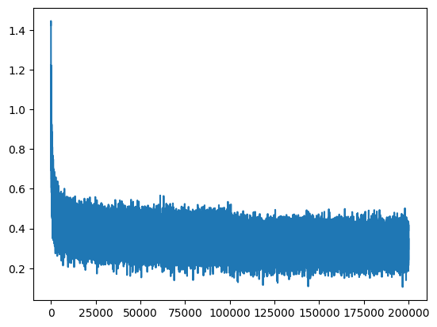
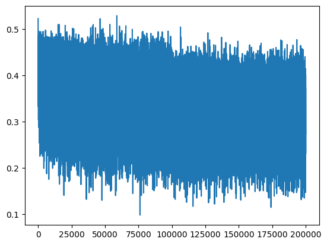
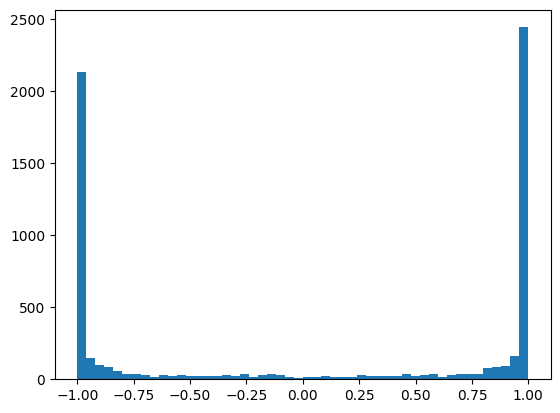
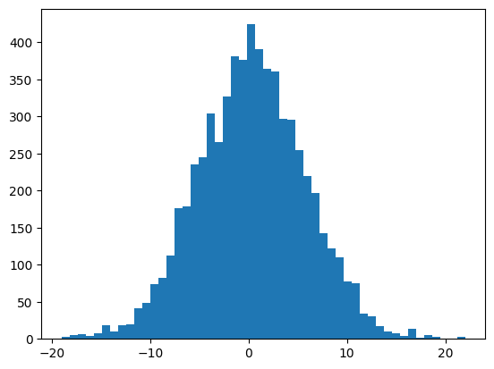
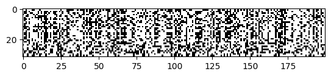
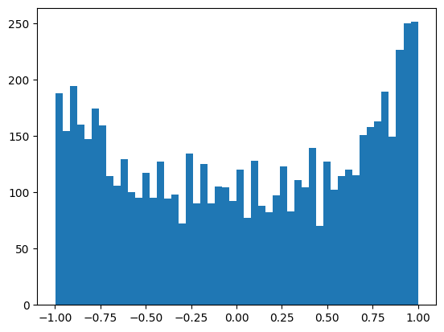
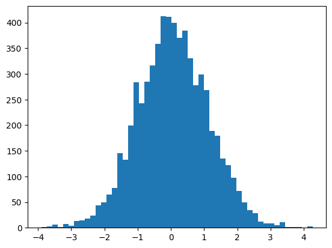
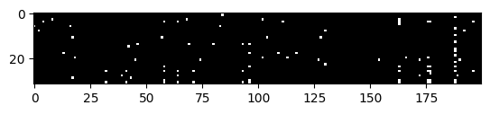
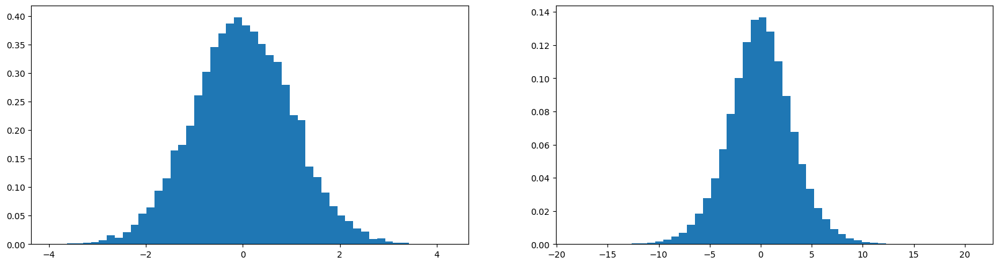

+++
title = 'TODO'
date = 2026-09-20
slug = 'makemore-batchnorm'
description = 'TODO'
tags = ['ai', 'language-models', 'neural-networks']
draft = true
+++

In the [prior post]() in this series, we TODO

## intro

want to understand the architecture intuitively

need to understand the activations and the gradients in order to understand why RNN-type architectures are difficult to optimize with our gradient-based techniques that we are used to

the starting point here is just the code from last time; factored out of the `makemore` abstractions to make tinkering a little easier. the architecture is the same, and the optimization strategy is the same.

initial training and validation loss

```
train = 2.1189258098602295
val   = 2.160738468170166
```

and the initial appearance of our training loss curve:



## fixing the initial loss

the first thing we'll scrutinize is the initialization of the network.

on the very first iteration, our loss is very high:

```
0/ 200000: 26.5404
...
```

this gives us some indication something is wrong with our initialization

when we are training a neural network, we typically have some apriori idea of what we expect the loss to be. how do we arrive at this expectation?

when the model is initialized randomly, we don't expect any character to be any more likely than any of the others. therefore, the probability assigned to every character should be uniform, and moreover be `1/27`

we can compute the loss we expect in this scenario with:

```python
-torch.tensor(1/27.0).log()
# 3.2958
```

so we expect an initial loss of `3.2958` but our actual initial loss is much higher at `26.5404`.

at initialization, the network is getting some initial probability distribution that is all messed up. this leads to a very high initial loss

can view a simple 4-dimensional example of the issue. first, when all of the logits are uniform:

```python
logits = torch.tensor([0.0, 0.0, 0.0, 0.0])
probs = torch.softmax(logits, dim=0)
loss = -probs[2].log()
loss
# tensor(1.3863)
```

then, suppose we by chance increase the magnitude of the logit that corresponds to the correct character:

```python
logits = torch.tensor([0.0, 0.0, 5.0, 0.0])
probs = torch.softmax(logits, dim=0)
loss = -probs[2].log()
loss
# tensor(0.0200)
```

now the loss is quite low. now suppose the initial logits are bad:

```python
logits = torch.tensor([-3.0, 5.0, 0.0, 2.0])
probs = torch.softmax(logits, dim=0)
loss = -probs[2].log()
loss
# tensor(5.0553)
```

now the loss is much higher than we anticipate with uniform logits.

we want the logits to be roughly equivalent when the network is initialized. they don't need to be zero necessarily, but making them all uniform at zero is an easy way to achieve this.

lets examine the logits in the first iteration of our training run

```python
logits[0]
# tensor([  9.8054, -10.7094, -18.9225,   4.5784,  25.0958,  12.3420,  25.2245,
#           2.3172,  23.1374, -15.8994,  -1.2803, -13.0714,  11.7869,  21.8830,
#         -10.2817, -10.7709,  13.7777,  -7.2771,  -1.5731,  15.3102,  -0.5203,
#         -18.8392,  30.8516,  16.5554, -18.1451,   2.9022, -36.2960],
#        grad_fn=<SelectBackward0>)
```

our logits take on extreme values; this is what is causing the loss to be high initially.

how do we make the logits come out close to zero initially? walk through how our logits are computed.

```python
logits = h @ W2 + b2
```

the logits are computed by multiplying the output of the hidden layer with `W2` and adding the bias from `b2`. therefore, we can force the logits towards `0` by setting `b2` to `0` and scaling `W2` down:

```python
W2 = torch.randn(
    (hidden_layer_size, len(vocab)),
    generator=g,
) * 0.01
b2 = torch.zeros((len(vocab),), requires_grad=True)
```

below, we'll cover why we don't set `W2` to `0` as well. this would force our logits to `0` but it has some negative consequences.

with this update, we can recompute our initial loss:

```
0/ 200000: 3.3316
```

and verify that our logits look better:

```python
logits[0]
# tensor([ 0.0779, -0.0220, -0.0341,  0.0942, -0.0999, -0.2566, -0.1150, -0.0405,
#          0.1536, -0.0327, -0.0188,  0.1812, -0.1498, -0.1085, -0.0655,  0.1500,
#         -0.1604, -0.0298,  0.1155, -0.0634, -0.1085,  0.0809, -0.1203, -0.2351,
#         -0.0003, -0.0076, -0.0656], grad_fn=<SelectBackward0>)
```

now we can re-run optimization.

the final training and validation losses are improved from the baseline. 

```
train = 2.0693347454071045
val   = 2.1326169967651367
```

we can see why when we plot the losses. now, the loss plot no longer looks like a hockey-stick. we spend all of our iterations doing the "hard" optimization work, and don't waste them just shrinking the weights to get rid of this high initial loss.



## fixing the saturated tanh

break after the first optimization iteration. we see that we have a reasonable initial loss now:

```
0/ 200000: 3.2975
```

we've looked at the logits and verified that these are ok. now the problem is with `h`:

```python
# non-linearity (complete hidden layer)
h = torch.tanh(hpreact)
# output layer
logits = h @ W2 + b2
```

these are the activations of the hidden states. we can see the problem if we visualize the distribution of the values within this tensor.

first, what are the dimensions of `h`:

```python
torch.Size([32, 200])
```

this is `32` examples by a hidden layer dimension of `200` neurons. then we can flatten this and convert it to a `list` so that we can plot it naively:

```bash
import matplotlib.pyplot as plt
plt.hist(h.view(-1).tolist(), 50);
```



a quick analysis of this distribution shows that a majority of these values are `-1` and `1`. the hyperbolic tangent activation maps values on the domain (-inf, inf) to (-1, 1). the activation is squashing all of the inputs onto this range. we can look at the pre-activations (the input to tanh) to see why this is happening:

```python
import matplotlib.pyplot as plt
plt.hist(hpreact.view(-1).tolist(), 50);
```



the range of the input is something like -20 to 20. this is what is creating the strange distribution for the output of the tanh activation.

**why is this a problem**

this is a problem because this distribution of the activations implies that gradients are being effectively lost as we backpropagate through the network during optimization.

here is the implementation of `tanh` from micrograd:

```python
def tanh(self) -> Value:
    x = self.data
    t = (math.exp(x) - math.exp(-x)) / (math.exp(x) + math.exp(-x))
    out = Value(t, (self,), "tanh")

    def _backward():
        self.grad += (1 - t**2) * out.grad

    out._backward = _backward
    return out
```

we see that the backward pass through `tanh` is implemented as `(1 - t**2) * out.grad`. `t` is the output of the `tanh` function; we just saw that this is typically `-1` or `1`. in either of these cases, `1 - t**2` reduces to effectively `0`, meaning that the gradient backpropagated through the `tanh` is also `0` (or near it).

this makes intuitive sense as well. because we are in a saturated region of the `tanh` function, small modifications to the input will not have much impact on the loss.

if the activation of `tanh` is exactly `0`, then the gradient is merely passed through during backpropagation. as we get closer to the tails, the gradient only decreases as the magnitude of the activation increases towards `-1` or `1`.

active part of `tanh` vs inactive part

**aside: other activations and dead neurons**

the same problem applies to other activation functions, e.g. sigmoid and ReLU

idea of a "dead neuron" -- if the neuron gets in a spot where the activation is such that during backpropagation the gradient is lost completely. look for these during optimization and during inference

in this plot, we see the activation from each neuron for each of the 32 examples:



a dead neuron would be represented here by a column of all white -- a neuron for which all 32 examples in the batch cause the activation to be sufficiently high-magnitude that the gradient is lost during backpropagation.

we don't have any of these in our current example, but it is still not optimal

**the fix**

we apply the fix by examining the pre-activations once more. the problem is that the values are too extreme -- too far from zero. we can scale the parameters for `W1` and `b1` to force the values produced by the pre-activation closer to zero, and thereby fix the distribution post-activation.

```python
# hidden layer
W1 = torch.randn(
    (
        BLOCK_SIZE * embedding_dimension,
        hidden_layer_size,
    ),
    generator=g,
) * 0.2
b1 = torch.randn(hidden_layer_size, generator=g) * 0.01
```

we can play with the amount of scaling to apply here. there is a tradeoff between the level of entropy that we get and the saturation fix that we're currently applying.

now the activation distribution looks much better:



because the pre-activation distribution is less extreme:



and we see almost a complete absence of examples for which any neuron produces an activation that results in a lost gradient update:



**results**

run the full optimization with the fix applied.

```
train = 2.036147117614746
val   = 2.101691484451294
```

## Calculating the Initialization Scale (Kaiming Initialization)

At this point, our network initialization looks like this:

```python
# hidden layer
W1 = torch.randn(
    (
        BLOCK_SIZE * embedding_dimension,
        hidden_layer_size,
    ),
    generator=g,
) * 0.2
b1 = torch.randn(hidden_layer_size, generator=g) * 0.01
# output layer
W2 = torch.randn(
    (hidden_layer_size, len(vocab)),
    generator=g,
) * 0.01
b2 = torch.randn(len(vocab, ), generator=g) * 0.0
```

The tensor dimension parameters, combined with the `generator` arguments clutter this visually, but the point is the presence of the various scaling factors we've introduced in order to "fix" various sub-optimal aspects of the optimization process that we've observed.

We scale each of our parameter tensors (aside from `C`) by some value in order to fix address some downstream issue (high initial loss, `tanh` saturation). We came up with these scaling factors by playing around with the network and observing the empirical results (e.g. how initial loss looked).

This is fine, but its labor intensive. It turns out there is a more principled way that we can arrive at some of these scaling factors that gives us (a) some assurance that we've selected an optimal value and (b) the ability to arrive at them without manual experimentation.

### A Motivating Example

We'll work our way towards this initialization method via a motivating example. Consider a simplified neural network that looks like this:

```python
x = torch.randn(1000, 10)
w = torch.randn(10, 200)
y = x @ w
```

We have our input tensor `x` multiplied by a weight tensor `w` to compute the output tensor `y`. Both `x` and `w` are normally, randomly distributed [`torch.randn`](https://docs.pytorch.org/docs/2.14/generated/torch.randn.html) with mean `0` and variance `1`. 

If we compare the mean and standard deviation of the values in `x` and `y`, we get:

```
mean(x) = -0.0005, std(x) = 1.0109
mean(y) = -0.0102, std(y) = 3.1495
```

So `x` has mean `0` and standard deviation `1`, as expected. Meanwhile, `y` has the same mean, but the standard deviation has increased to roughly `3`. We can observe the same phenomenon in a plot of the two distributions:



The matrix multiplication by `w` has the effect of "stretching out" the distribution of the values that is present in the input `x`. As we scale `w` we can see how this continues to changes the standard deviation for `y`. If we scale it up, the standard deviation increases:

```python
w = torch.randn(10, 200) * 5.0
```

`y` now has a standard deviation of `15.5825`. Conversely, scaling it down decreases the standard deviation of `y`:

```python
w = torch.randn(10, 200) * 0.1
```

This scaling factor gives a standard deviation of `0.3187`.

In general, we want to keep a consistent mean of `0` and standard deviation of `1` throughout our entire network. [TODO: WHY?] The question becomes: how do we find the scaling factor that allows us to do this?

Mathematically, the way to accomplish this is to scale by dividing element-wise by the square root of the _fan-in_ for the layer, where the fan-in is just the number of inputs. Here, `w` has shape `(10, 200)`, so we can implement this for our network like:

```python
w = torch.randn(10, 200) * 1/10**0.5
```

I implement division by multiplying by the multiplicative inverse. This keeps the calculation consistent with the form it will take in subsequent updates.

With this scale applied, now we get a standard deviation of `0.9848` for the output Gaussian `y`, very close to our target of `1`.

### Kaiming Initialization

Now we want to apply this same type of reasoning to the initialization of our neural network. The approach that we'll follow comes from the influential paper [Delving Deep into Rectifiers](https://arxiv.org/abs/1502.01852) by _Kaiming et al._

Here, the authors specifically look at the ReLU and PReLU activations specifically, but we can apply the results to our `tanh` activations as well.

Kaiming et al.'s analysis introduces the notion of _gain_ -- a small value that augments the scaling factor we found above (one over the square root of the fan-in) to account for the specific nature of the nonlinearity. For instance, for the ReLU activation function, they find that the scaling factor needed to optimally preserve the gaussian is:

$$\frac{2}{\sqrt{n}}$$

where $n$ represents the fan-in.

In general, they find that initialization in which values are sampled from $\mathcal{N}(0, std^2)$ preserves the gaussian optimally, where:

$$std = \frac{gain}{\sqrt{fan\_mode}}$$

This concept is now known as "Kaiming initialization" or "Kaiming init". The method is so pervasive that it is implemented directly in PyTorch within its [init module](https://docs.pytorch.org/docs/2.14/nn.init.html#torch.nn.init.kaiming_normal_). The module provides its own table of values for _gain_ that make the initialization unambiguous:

| Nonlinearity | Gain |
| --- | --- |
|  Linear / Identity | 1 |
| Conv{1,2,3}D | 1 |
| Sigmoid | 1 |
| Tanh | $\frac{5}{3}$ |
| ReLU | $\sqrt{2}$ |
| Leaky ReLU | $\sqrt{\frac{2}{1 + negative\_slope^2}}$ |
| SELU | $\frac{3}{4}$ |

We see that the gain for the ReLU nonlinearity is $\sqrt{2}$, like we saw above. For tanh, the gain is $\frac{5}{3}$; this is what we'll use in our implementation.

### Applying to Our Network

According to Kaiming initialization, we want to initialize our network such that the parameters are distributed like $\mathcal{N}(0, std^2)$ where

$$std = \frac{gain}{\sqrt{fan\_in}}$$

Currently, our initialization looks like:

```python
W1 = torch.randn(
    (
        BLOCK_SIZE * embedding_dimension,
        hidden_layer_size,
    ),
    generator=g,
) * 0.2
```

Because we use `torch.randn` for initialization, our tensor is already initialized with a distribution that resembles a gaussian with mean 0 and standard deviation 0.2, because of the previous scaling we applied. We can merely swap this scaling by 0.2 with the value we compute according to the Kaiming init method:

```python
kaiming_init_scale = (5/3) / ((BLOCK_SIZE * embedding_dimension)**0.5)
```

Where `BLOCK_SIZE * embedding_dimension` is our fan-in. The resolved value comes out as: `0.3042903097250923`, meaning we had previously selected a scaling factor that was just `0.1` off the value suggested by the Kaiming initialization method.

Completing the initialization:

```python
kaiming_init_scale = (5/3) / ((BLOCK_SIZE * embedding_dimension)**0.5)
W1 = torch.randn(
    (
        BLOCK_SIZE * embedding_dimension,
        hidden_layer_size,
    ),
    generator=g,
) * kaiming_init_scale
```

Now we can run optimization again to observe the impact on our final loss values:

```
train = 2.0376644134521484
val   = 2.106989622116089
```

Ultimately, the new initialization makes very little difference, and actually degrades validation performance slightly.

### loss log

starting point

```
train = 2.1189258098602295
val   = 2.160738468170166
```

after fixing the initial loss

```
train = 2.0693347454071045
val   = 2.1326169967651367
```

after fixing `tanh` saturation

```
train = 2.036147117614746
val   = 2.101691484451294
```

after kaiming init:

```
train = 2.0376644134521484
val   = 2.106989622116089
```
